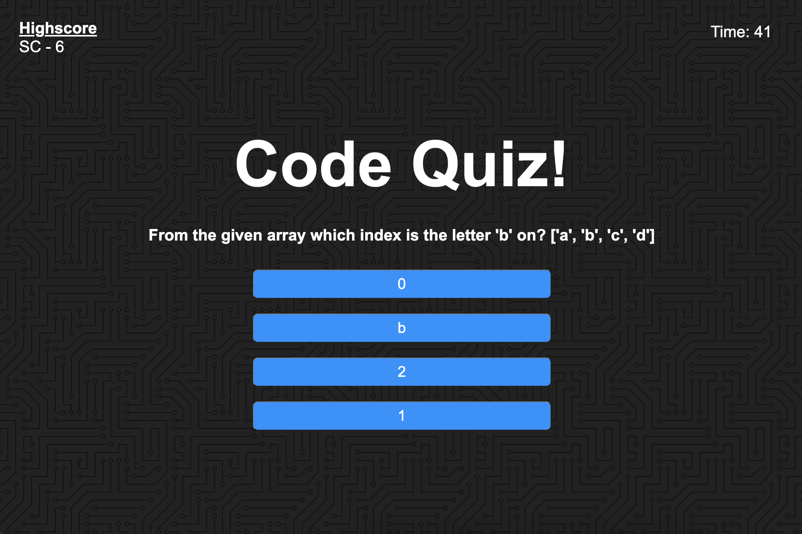

# Quizzy Quiz

A quiz quizing you on the most important things - things you need to be quizzed on.

- What we have here is a short quiz on some basic javascript knowledge.
- When the "Start Quiz!" button is selected, the first qustion will appear and a timer set to 50 seconds will begin. Choose your answer carefully, because if you choose wrong you loose 15 seconds!
- When the quiz is over, you will have either answered all available questions or the timer has run out.
- You will recieve youre final score and the score alongside your initials will be forever imortalized in our highscore section! (..until the next time you play)

- This project contains html, css , and javascript. It was a challenge that personally helped me wrap my head around local storage properties and the options that I have to work with when it comes to dynamically changing elements on a webpage while working with javascript. It also helped me to clear up some blockers I was dealing with understanding boths functions and scope.

Try the quiz here: [https://shaneconwell.github.io/quizzy-quiz/](https://shaneconwell.github.io/quizzy-quiz/)

